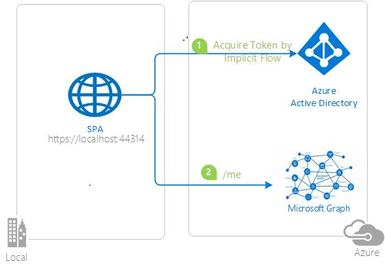

# Call Microsoft Graph on behalf-of the signed-in users in your Blazor WebAssembly Application

 1. [Overview](#overview)
 1. [Scenario](#scenario)
 1. [How to run this sample](#how-to-run-this-sample)
 1. [Running the sample](#running-the-sample)
 1. [Explore the sample](#explore-the-sample)
 1. [Deployment](#deployment)
 1. [More information](#more-information)
 1. [Community Help and Support](#community-help-and-support)
 1. [Contributing](#contributing)

## Overview

In the second chapter, we extend our ASP.NET Core Blazor WebAssembly standalone application to call a downstream API (Microsoft Graph) to obtain more information about the signed-in user.

This sample demonstrates an ASP.NET Core Blazor WebAssembly standalone application that authenticates users against [Azure Active Directory (Azure AD)](https://docs.microsoft.com/azure/active-directory/fundamentals/active-directory-whatis) using the [Microsoft Authentication Library for JavaScript](https://github.com/AzureAD/microsoft-authentication-library-for-js) (MSAL.js). It then acquires an Access Token for Microsoft Graph and calls the [Microsoft Graph API](https://docs.microsoft.com/graph/overview).

## Scenario

With respect to the previous chapter of the tutorial, this chapter adds the following steps:

1. The client application acquires an Access Token for Microsoft Graph.
1. The **Access Token** is used as a *bearer* token to authorize the user to call the [Microsoft Graph API](https://docs.microsoft.com/graph/overview)
1. **Microsoft Graph API** responds with the resource that the user has access to.



## How to run this sample

### In the downloaded folder

From your shell or command line:

```Shell
cd ms-identity-blazor-wasm\WebApp-graph-user\Call-MSGraph
```

### Update the Registration for the sample application(s) with your Azure Active Directory tenant

#### Update Registration for the web app (WebApp-blazor-wasm)

1. In **App registrations** page, find the *WebApp-blazor-wasm* app
1. In the app's registration screen, select **Authentication** in the menu.
   - In **Implicit grant** section, select the check box for Access tokens.
   - Select **Save** to save your changes.
1. In the app's registration screen, select the **API permissions** blade in the left to open the page where we add access to the APIs that your application needs.
   - Select the **Add a permission** button and then,
   - Ensure that the **Microsoft APIs** tab is selected.
   - In the *Commonly used Microsoft APIs* section, select **Microsoft Graph**
   - In the **Delegated permissions** section, select the **User.Read** in the list. Use the search box if necessary.
   - Select the **Add permissions** button at the bottom.

#### Configure the web app (WebApp-blazor-wasm)

1. Open `blazorwasm-calls-MS-graph\wwwroot\appsettings.json` file and copy the details from `WebApp-OIDC\blazorwasm-singleOrg\wwwroot\appsettings.json` file.

## Running the sample

You can run the sample by using either Visual Studio or command line interface as shown below:

### Run the sample using Visual Studio

Clean the solution, rebuild the solution, and run it.

### Run the sample using a command line interface such as VS Code integrated terminal

#### Step 1. Install .NET Core dependencies

```console
cd WebApp-graph-user\Call-MSGraph
cd blazorwasm-calls-MS-graph
dotnet restore
```

#### Step 2. Trust development certificates

```console
dotnet dev-certs https --clean
dotnet dev-certs https --trust
```

Learn more about [HTTPS in .NET Core](https://docs.microsoft.com/aspnet/core/security/enforcing-ssl).

#### Step 3. Run the applications

In the console window execute the below command:

```console
dotnet run
```

## Explore the sample

> If you are using incognito mode of browser to run this sample then allow third party cookies.

1. Open your browser and navigate to `https://localhost:44314`.
1. Select the **Sign in** button on the top right corner. You will see claims from the signed-in user's token.

    

1. Select **Profile** from navigation bar on the left. If user has signed-in then information fetched from Microsoft Graph is displayed, otherwise login screen will appear.

    

> :information_source: Did the sample not work for you as expected? Then please reach out to us using the [GitHub Issues](../../../../issues) page.

## We'd love your feedback!

Were we successful in addressing your learning objective? [Do consider taking a moment to share your experience with us.](https://forms.office.com/Pages/ResponsePage.aspx?id=v4j5cvGGr0GRqy180BHbR73pcsbpbxNJuZCMKN0lURpUMEw0UFNBVVBEV1E3VFNBU1I0T05TNzhPViQlQCN0PWcu)

## About the code

For details about the code to enable your Blazor Single-page Application (SPA) to sign-in users, see [About the code](../../WebApp-OIDC/MyOrg/README.md#about-the-code) section, of the README.md file located at **WebApp-OIDC/MyOrg**.

This section, here, is only about the additional code added to let the Web App call the Microsoft Graph.

1. In Program.cs, Main method registers AddMicrosoftGraphClient as explained below:

    ```csharp
    builder.Services.AddMicrosoftGraphClient("https://graph.microsoft.com/User.Read");
    ```

    **AddMsalAuthentication** is an extension method provided by GraphClientExtensions.cs class.

1. **UserProfile.razor** component displays user information retrieved by **GetUserProfile** method of **UserProfileBase.cs**.

    **UserProfileBase.cs** calls Microsoft Graph `/me` endpoint to retrieve user information.

    ```csharp
    public class UserProfileBase : ComponentBase
    {
        [Inject]
        GraphServiceClient GraphClient { get; set; }
        protected User _user=new User();
        protected override async Task OnInitializedAsync()
        {
            await GetUserProfile();
        }
        private async Task GetUserProfile()
        {
            ...
                var request = GraphClient.Me.Request();
                _user = await request.GetAsync();
            ...
        }
    }
    ```

## Deployment

See [README.md](../../Deploy-to-Azure/README.md) to deploy this sample to Azure.

## More information

- [Microsoft Graph permissions reference](https://docs.microsoft.com/graph/permissions-reference)
- [Authentication and authorization basics for Microsoft Graph](https://docs.microsoft.com/graph/auth/auth-concepts)
- [ASP.NET Core Blazor WebAssembly additional security scenarios](https://docs.microsoft.com/aspnet/core/blazor/security/webassembly/additional-scenarios)

## Community Help and Support

Use [Stack Overflow](http://stackoverflow.com/questions/tagged/msal) to get support from the community.
Ask your questions on Stack Overflow first and browse existing issues to see if someone has asked your question before.
Make sure that your questions or comments are tagged with [`azure-active-directory` `ms-identity` `msal`].

If you find a bug in the sample, raise the issue on [GitHub Issues](../../issues).

To provide feedback on or suggest features for Azure Active Directory, visit [User Voice page](https://feedback.azure.com/forums/169401-azure-active-directory).

## Contributing

If you'd like to contribute to this sample, see [CONTRIBUTING.MD](../../CONTRIBUTING.md).

This project has adopted the [Microsoft Open Source Code of Conduct](https://opensource.microsoft.com/codeofconduct/). For more information, see the [Code of Conduct FAQ](https://opensource.microsoft.com/codeofconduct/faq/) or contact [opencode@microsoft.com](mailto:opencode@microsoft.com) with any additional questions or comments.